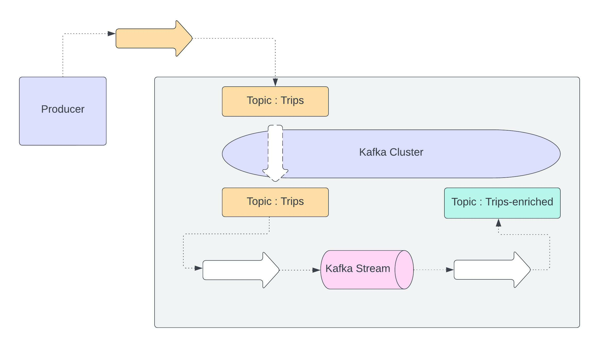
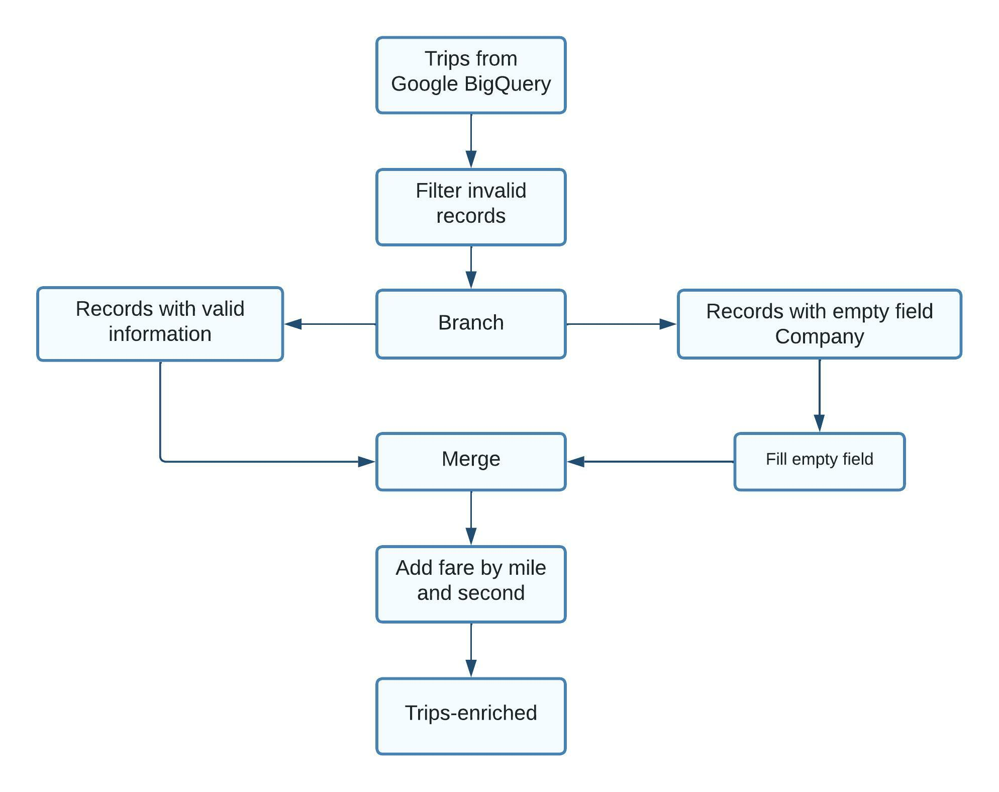
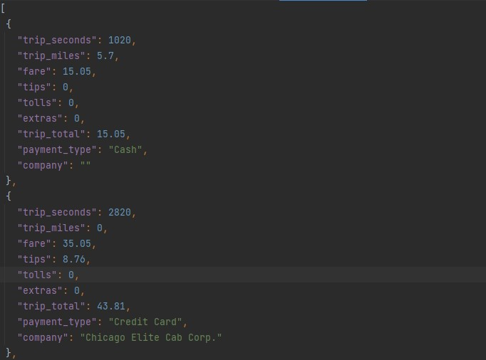
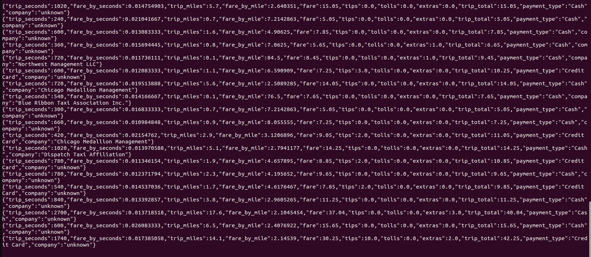

# KAFKA STATELESS STREAMING

This project resembles a stateless streaming filtering, transforming and merging records taken from a source topic and delivering them to a different topic.

## Kafka Structure

The producer is a different application that takes records from a json files a places them in the topic Trips.
The Kafka stream application takes the information from this original source topic and after filtering, processing, and merging takes the output to the topic Trips-enriched


## Stream structure



## Original Records



## Final Results



## Consumer

You can see the results using the comands

```
$ docker-compose exec schema-registry bash

$ kafka-avro-console-consumer \
 --bootstrap-server kafka:9092 \
 --topic trips-enriched \
 --from-beginning
```

## Topics

You can see the topics with

```
$ docker-compose exec kafka bash

$ kafka-topics \
  --bootstrap-server kafka:9092 \
  --list
```
